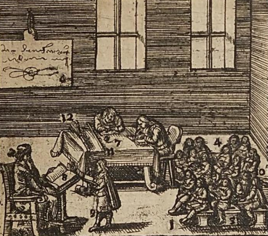

<link rel="stylesheet" href="assets/style.css">

### Per un'altra scuola

<figure>
  
  <figcaption>La scuola. Illustrazione tratta da Comenius, <a href="https://play.google.com/books/reader?id=iFGQ4C6IrUQC&pg=GBS.PA240&hl=it">Orbis sensualium pictus</a>, Kaspar Müller, Wratislav 1667.</figcaption>
</figure>

Ho scritto tempo fa _Contro la scuola_, una sintesi un po' brutale delle mie ragioni contro l'istituzione scolastica; un esercizio paradossale, per un docente, e tuttavia utile -- probabilmente ineludibile. Ne ho discusso con diversi amici, incontrando inaspettatamente più consensi che reazioni allarmate.

Qualche mese fa ho ripreso il testo con l'idea di farne un _pamphlet_. Ma gli appunti si sono moltiplicati e il _pamphlet_ sta diventando un libro, il cui titolo provvisorio è _Senza cattedra. Per un'altra scuola_. Lo pubblicherò qui capitolo dopo capitolo, proponendolo alla discussione e alla critica, con una licenza [Creative Commons BY-NC-ND](https://creativecommons.org/licenses/by-nc-nd/4.0/deed.it).

Chi voglia discuterne può contattarmi alla mail: antoniovigilante@autistici.org

### Indice

[Introduzione](introduzione.md)  
[Prologo. Contro la scuola](contro-la-scuola)  
[1. La situazione educativa](cap01.md)  
[2. Sinagogia](cap02.md)   
[3. L'officina scolastica](cap03.md)  
[4. Un'uguaglianza di fatto](cap04.md)  
[5. Ratio](cap05.md)  
[6. I giardini di Adone](cap06.md)  
[7. L'educazione popolare](cap07.md)  
[8. Barbiana](cap08.md)  
9\. Ostacoli  
10\. L'alienazione scolastica  
11\. Otium  
Conclusione  
[Bibliografia](bibliografia.md)  

Nell'immagine: l'Accademia di Platone. Mosaico proveniente da Pompei. Napoli, Museo Archeologico.
